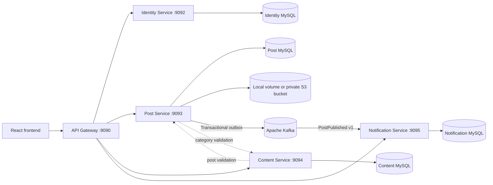

# Microservices Backend

Spring Boot microservices for a blogging platform, migrated incrementally from a monolithic API with the strangler pattern.

**Status:** the five-phase core migration, Phase 6 Kafka event workflow, local full-stack integration, Jenkins CI, and local Kubernetes deployment are complete. The Post Service is S3-ready through a profile-based storage adapter, while actual AWS deployment is intentionally deferred.

Companion React client: [studywithdanish/microservices-frontend](https://github.com/studywithdanish/microservices-frontend)

## Current Architecture

Phase 5 completes the core monolith-to-microservices migration. Spring Cloud Gateway remains the only public API entry point, so the frontend keeps the same URLs while every business capability is independently deployed and owns its database.



High-level structure:

- Spring Cloud Gateway owns the public API boundary on port `9090`
- The Identity Service owns users, credentials, roles, registration, login, and JWT issuance
- The Post Service owns posts, category snapshots, images, and post authorization
- The Content Service owns categories and comments
- The Notification Service consumes versioned Kafka events and owns user notifications
- Post creation records a `PostPublished` event in a transactional outbox before asynchronous publication
- Kafka delivery is at-least-once; event IDs make notification consumption idempotent
- Failed consumer records are retried and then moved to `blog.posts.published.v1.DLT`
- Services validate identity claims locally and do not query identity data
- Every business service has its own Flyway-managed MySQL database
- All downstream services are private inside Docker and enforce their own authorization
- The original backend is absent from the active runtime and retained temporarily for rollback
- Services contain business logic
- Repositories handle persistence through Spring Data JPA
- Spring Security protects write/admin operations with JWT-based authentication
- MySQL is used for local/prod-style runtime, while tests use an isolated H2 profile
- Docker Compose and Kubernetes run the gateway, four private business services, Kafka, and four MySQL databases

## Engineering Improvements

This repository is being upgraded step by step with a commit history that shows the modernization journey.

Completed improvements:

- Upgraded to Spring Boot 3 and Spring Security 6
- Replaced legacy Swagger setup with springdoc OpenAPI
- Externalized environment-specific configuration
- Removed secrets from current application configuration
- Added Dockerfile and Docker Compose runtime
- Added Jenkins CI pipeline with Maven test/package and Docker image build stages
- Added Actuator health and info endpoints
- Added Docker healthcheck using `/actuator/health`
- Added Flyway baseline migration for repeatable production schema creation
- Added service, controller, and security access tests
- Replaced console output with structured SLF4J logging
- Encoded passwords consistently across user mutation flows
- Refactored services and controllers to constructor injection
- Completed Phase 1 microservice-readiness boundaries and ownership controls
- Completed Phase 2 API Gateway routing, correlation IDs, failure handling, Docker integration, and CI coverage
- Completed Phase 3 Identity Service extraction, database ownership, gateway routing, and claim-based downstream authorization
- Completed Phase 4 Post Service extraction, independent post data, image ownership, and private comment integration
- Completed Phase 5 Content Service extraction, final database ownership, explicit gateway routing, and backend retirement
- Added a safe initial `General` category for an empty Content database so a fresh local environment supports post creation
- Verified the React registration, login, profile, post, category, and comment flows through the gateway
- Added a dedicated Minikube deployment with persistent MySQL and image storage, generated runtime secrets, health probes, resource limits, and an end-to-end smoke test
- Added Apache Kafka in KRaft mode, a durable Post Service outbox, a versioned `PostPublished` event, an idempotent Notification Service consumer, retry/DLT handling, and asynchronous smoke-test coverage
- Added profile-based post-image storage with a local filesystem default and a private Amazon S3 implementation using the AWS SDK credential chain, SSE-S3 encryption, bounded calls, and unchanged public APIs

## Documentation Map

- [Architecture reference](docs/architecture.md) — topology, route/data ownership, security, reliability, and migration sequence
- [Local end-to-end runbook](docs/local-end-to-end.md) — Docker, React, browser journey, checks, and troubleshooting
- [Local Kubernetes runbook](deploy/k8s/README.md) — dedicated Minikube profile, deployment, smoke test, and diagnostics
- [Interview and resume guide](docs/interview-and-resume-guide.md) — project pitch, factual resume bullets, design answers, and demo order
- [Phase 3 Identity extraction](docs/phase-3-identity-service.md)
- [Phase 4 Post extraction](docs/phase-4-post-service.md)
- [Phase 5 Content extraction](docs/phase-5-content-service.md)
- [Phase 6 Kafka events](docs/phase-6-kafka-events.md) — outbox, event contract, delivery guarantees, consumer idempotency, and operations
- [AWS S3 image storage](docs/aws-s3-image-storage.md) — architecture, configuration, security decisions, rollout, rollback, and interview guidance

## Phase 1: Microservice-Ready Modular Monolith

Phase 1 keeps one deployable Spring Boot application while reducing the coupling that would make later service extraction risky.

Implemented boundaries and safeguards:

- Replaced the shared user DTO with separate registration, update, and response contracts so passwords are never returned by user APIs
- Replaced cross-domain JPA object graphs with scalar ownership identifiers (`authorId` and `postId`) across user, post, and comment boundaries
- Derived the acting user from the authenticated JWT identity instead of trusting client-supplied user IDs
- Enforced owner-or-admin authorization for user, post, comment, and post-image mutations
- Restricted category mutations and user administration APIs to administrators
- Added validated post and comment request contracts and strengthened login/registration validation
- Added safe image type checks and normalized storage paths to prevent unsupported uploads and path traversal
- Added Flyway migration `V2__prepare_service_ownership_boundaries.sql` for ownership indexes, removal of the cross-boundary post/user foreign key, and comment lifecycle handling
- Added unit and security tests for the new ownership and authorization rules

The preferred authenticated post creation endpoint is:

```text
POST /api/posts
```

For a gradual frontend migration, the existing post-creation route remains available but validates its `userId` against the authenticated user. Registration passwords must be 8-72 characters.

## Phase 2: API Gateway Migration Seam

Phase 2 introduces a separately built and deployed Spring Cloud Gateway without prematurely splitting business data.

```text
Frontend -> API Gateway :9090 -> Modular backend :9090 (private Docker network) -> MySQL
```

Implemented gateway capabilities:

- Stable public routing for `/api/**`, Swagger UI, and OpenAPI endpoints
- Translation of the browser's HttpOnly authentication cookie into an internal JWT bearer header
- Validated or generated `X-Correlation-Id` request and response headers
- Central browser CORS policy with duplicate downstream headers removed
- Explicit connection and response timeouts
- Consistent `503` and `504` JSON responses for unavailable or slow downstream services
- Gateway-owned health and info endpoints
- Backend isolation from the host network in Docker Compose
- Independent gateway tests, Maven build, Docker image, and Jenkins stages
- Production Caddy routing through the gateway instead of directly to the backend

Phase 2 deliberately retained authentication in the backend. Phase 3 completes the next strangler step described below.

## Phase 3: Identity Service Extraction

The first business capability now runs as a standalone Spring Boot service:

- `/api/v1/auth/**` and `/api/users/**` route to the Identity Service
- All other `/api/**` requests continue to route to the content backend
- Existing frontend URLs and JSON contracts are preserved
- The Identity Service owns a separate `blog_identity` schema and Flyway history
- Password hashing, credential checks, roles, user profiles, and JWT issuance were removed from the content backend
- JWTs carry signed `userId`, email subject, and role claims
- The content backend authorizes ownership from verified claims without a cross-service database lookup
- Docker Compose, production Compose, Jenkins, health checks, and automated tests cover the new service

The detailed rollout, data migration, rollback, and smoke-test guide is in [Phase 3 Identity Service](docs/phase-3-identity-service.md).

## Phase 4: Post Service Extraction

Posts and post images now run as a standalone service without sharing tables with the remaining backend:

- Existing post, search, user-post, category-post, and image URLs route to the Post Service
- `/api/posts/{postId}/comments` deliberately remains on the backend until Phase 5
- Post records live in a separate `blog_posts` database
- Category details are copied into an immutable post snapshot when a post is created
- The Post Service validates categories through the backend API instead of reading category tables
- The Comment module checks post existence through a private token-protected endpoint
- The legacy comments-to-posts database foreign key is removed by Flyway migration `V3`
- Legacy post tables remain temporarily for rollback but are no longer mapped at runtime
- JWT owner-or-admin rules and safe image validation moved with the capability

See [Phase 4 Post Service](docs/phase-4-post-service.md) for route ownership, migration, rollback, and smoke tests.

## Phase 5: Content Service Extraction

Categories and Comments now run as the final standalone business service:

- `/api/categories/**`, `/api/posts/{postId}/comments`, and `/api/comments/**` route to Content Service
- Categories and comments live in a separate `blog_content` database
- Comments store scalar Post and Identity identifiers instead of cross-database relationships
- Content Service validates Post IDs through the private token-protected Post Service endpoint
- Category mutations require administrators; comment deletion requires the owner or an administrator
- Gateway catch-all routing has been removed, so unknown and private paths are not exposed
- Post Service resolves new category snapshots through Content Service
- The old backend and schema are no longer deployed, but remain temporarily available for rollback

See [Phase 5 Content Service](docs/phase-5-content-service.md) for migration, cutover, verification, rollback, and interview guidance.

## Phase 6: Kafka Event-Driven Notifications

Post creation now demonstrates a reliable asynchronous workflow rather than a direct dual write:

1. Post Service commits the post and a `PostPublished` outbox row in one MySQL transaction.
2. A scheduled relay publishes the versioned JSON event to `blog.posts.published.v1` with the post ID as its Kafka key.
3. Notification Service consumes the event as consumer group `notification-service-v1` and creates a durable notification for the author.
4. The event ID has a unique database constraint, making redelivery safe.
5. Consumer failures are retried twice and then published to `blog.posts.published.v1.DLT`.

The API Gateway exposes authenticated reads at `GET /api/notifications` and ownership-safe updates at `PUT /api/notifications/{id}/read`. See [Phase 6 Kafka Events](docs/phase-6-kafka-events.md).

## Tech Stack

- Java 17
- Spring Boot 3.5
- Spring Security 6
- Spring Cloud Gateway 4.3
- Project Reactor and WebFlux
- Spring Data JPA
- MySQL
- JWT authentication
- springdoc OpenAPI
- Spring Boot Actuator
- Flyway
- Docker and Docker Compose
- Kubernetes, Kustomize, and Minikube
- Jenkins
- Apache Kafka 3.9 in KRaft mode
- Spring for Apache Kafka
- AWS SDK for Java 2.x and Amazon S3
- JUnit 5, Mockito, MockMvc, Spring Security Test

## Run Locally With Docker

Copy the environment template:

```bash
cp .env.example .env
```

Start all four databases, all four business services, Kafka, and the gateway:

```bash
docker compose up --build
```

The gateway runs at:

```text
http://localhost:9090
```

Health and application info endpoints are available at:

```text
http://localhost:9090/actuator/health
http://localhost:9090/actuator/info
```

Check container health status:

```bash
docker compose ps
```

Stop the stack:

```bash
docker compose down
```

Remove local database and uploaded image volumes:

```bash
docker compose down -v
```

## Run Locally With Kubernetes

Create the dedicated cluster once:

```powershell
minikube start -p blog-platform --driver=docker --memory=6144 --cpus=4
```

Build, load, and deploy all application images:

```powershell
.\deploy\k8s\scripts\deploy-local.ps1 -Profile blog-platform
```

On Windows with the Docker driver, expose the frontend locally and run the end-to-end verification:

```powershell
kubectl -n blog-platform port-forward service/frontend 18080:80
.\deploy\k8s\scripts\smoke-test.ps1 -BaseUrl http://localhost:18080 -Profile blog-platform
```

See the [local Kubernetes runbook](deploy/k8s/README.md) for resource requirements, diagnostics, and cleanup.

## Run Tests

```bash
mvn clean test
```

Tests use an isolated H2 database profile and do not require local MySQL.

Run the Identity Service tests independently:

```bash
mvn -f identity-service/pom.xml clean test
```

Run the Post Service tests independently:

```bash
mvn -f post-service/pom.xml clean test
```

Run the Content Service tests independently:

```bash
mvn -f content-service/pom.xml clean test
```

Run the gateway tests independently:

```bash
mvn -f gateway-service/pom.xml clean test
```

Run the Notification Service tests independently:

```bash
mvn -f notification-service/pom.xml clean test
```

## Jenkins Pipeline

This repository includes a `Jenkinsfile` for a basic CI pipeline.

Pipeline stages:

- Checkout source code
- Verify Java and Maven versions
- Run legacy rollback backend plus Gateway, Identity, Post, Content, and Notification Maven tests
- Publish JUnit test reports
- Package all five Spring Boot applications, including the retained rollback application
- Build the five active service images plus the retained rollback image
- Validate Docker Compose and Kubernetes deployment configuration
- Archive all generated JAR artifacts

The Jenkins agent must have Java 17, Maven, Docker, and kubectl on its system `PATH`, with permission to run Docker commands.

Docker images are tagged as:

```text
blog-app-apis:<jenkins-build-number>
blog-app-apis:latest
blog-api-gateway:<jenkins-build-number>
blog-api-gateway:latest
blog-identity-service:<jenkins-build-number>
blog-identity-service:latest
blog-post-service:<jenkins-build-number>
blog-post-service:latest
blog-content-service:<jenkins-build-number>
blog-content-service:latest
blog-notification-service:<jenkins-build-number>
blog-notification-service:latest
```

`blog-app-apis` is retained and validated as a temporary rollback artifact. It is not started by the active Phase 5 Docker Compose topology.

Create a Jenkins Pipeline job and point it to this GitHub repository. Jenkins will read the `Jenkinsfile` from the repository root.

## Environment Variables

Use `.env.example` as the reference for local development. Do not commit `.env`.

Use `.env.production.example` as the reference for live deployment. Do not commit real production values.

Important variables:

- `SPRING_PROFILES_ACTIVE`
- `IDENTITY_DB_URL`
- `IDENTITY_DB_USERNAME`
- `IDENTITY_DB_PASSWORD`
- `POST_DB_URL`
- `POST_DB_USERNAME`
- `POST_DB_PASSWORD`
- `CONTENT_DB_URL`
- `CONTENT_DB_USERNAME`
- `CONTENT_DB_PASSWORD`
- `NOTIFICATION_DB_URL`
- `NOTIFICATION_DB_USERNAME`
- `NOTIFICATION_DB_PASSWORD`
- `KAFKA_BOOTSTRAP_SERVERS`
- `KAFKA_NOTIFICATION_GROUP_ID`
- `POST_PUBLISHED_TOPIC`
- `POST_PUBLISHED_DLT_TOPIC`
- `JWT_SECRET`
- `INTERNAL_SERVICE_TOKEN`
- `JWT_EXPIRATION_MS`
- `CORS_ALLOWED_ORIGINS`
- `GATEWAY_PORT`
- `IDENTITY_BASE_URL` (manual non-Docker gateway runs)
- `POST_SERVICE_BASE_URL` (manual non-Docker gateway runs)
- `CONTENT_SERVICE_BASE_URL` (manual non-Docker gateway runs)
- `CATEGORY_SERVICE_BASE_URL` (manual non-Docker Post Service runs)

The optional S3 image provider also uses `POST_IMAGE_S3_BUCKET`, `AWS_REGION`, and `POST_IMAGE_S3_KEY_PREFIX`. It is enabled only when the Post Service runs with the `aws` profile; see [AWS S3 image storage](docs/aws-s3-image-storage.md).

## API Documentation

Each MVC business service generates OpenAPI documentation through springdoc when run directly:

```text
/v3/api-docs
/swagger-ui/index.html
```

## Operational Endpoints

The API Gateway exposes only safe public Actuator endpoints by default:

```text
/actuator/health
/actuator/info
```

These endpoints report gateway health and are used for local Docker checks, CI/CD verification, and future AWS or monitoring integrations. Each private service also has its own container healthcheck.

## Production Readiness

The platform is ready for gateway-fronted portfolio demonstrations using Docker Compose or local Kubernetes.

Important deployment behavior:

- Local development uses the `dev` profile by default
- Live deployment should use `SPRING_PROFILES_ACTIVE=prod`
- Flyway creates the baseline database schema in a repeatable way
- The production profile uses `spring.jpa.hibernate.ddl-auto=validate`
- Secrets and environment-specific values are passed through environment variables
- CORS must be restricted to the deployed frontend URL
- Actuator exposes only `/actuator/health` and `/actuator/info`
- Post images remain on the local volume unless the additional `aws` profile and S3 bucket configuration are supplied

For a frontend deployed at `https://your-domain.com`, use:

```text
CORS_ALLOWED_ORIGINS=https://your-domain.com
```

## Dependency And Security Checks

Backend dependency versions are managed through the Spring Boot parent wherever possible. This keeps Spring, Jackson, Tomcat, validation, logging, and test dependencies aligned with the selected Spring Boot release.

Recommended checks before deployment:

```bash
mvn test
mvn -f identity-service/pom.xml test
mvn -f post-service/pom.xml test
mvn -f content-service/pom.xml test
mvn -f gateway-service/pom.xml test
mvn dependency:tree
mvn -f identity-service/pom.xml dependency:tree
mvn -f post-service/pom.xml dependency:tree
mvn -f content-service/pom.xml dependency:tree
mvn -f gateway-service/pom.xml dependency:tree
```

Security-related improvements already applied:

- No committed runtime secrets in current configuration
- BCrypt password encoding
- JWT secret externalized through `JWT_SECRET`
- Stateless Spring Security filter chain
- Public endpoints explicitly whitelisted in each service
- Identity data is no longer shared with the content database
- Downstream authorization uses verified JWT identity and role claims
- Production schema managed by Flyway instead of Hibernate auto-create
- Health endpoint available for Docker, CI/CD, and AWS checks

## Deployment Roadmap

The remaining deployment path is incremental and cost-aware. It is outside the current local-completion scope:

The S3 application adapter is complete but deliberately inactive in the current Docker Compose and Kubernetes environments. No AWS account, bucket, IAM role, or live application was changed.

1. Provision a private S3 bucket and workload IAM role through Terraform.
2. Deploy the gateway, Identity, Post, Content, Notification, and Kafka topology as the stable AWS baseline.
3. Store runtime configuration as environment variables or managed configuration and use workload identity for AWS credentials.
4. Add a Docker image registry push stage in Jenkins.
5. Add centralized logs and basic metrics.
6. Add Prometheus and Grafana after the live deployment is stable.

The production Docker Compose and AWS runbook are available in:

```text
deploy/
```

## Microservices Migration Status

The core strangler migration is complete. The original backend source and data are retained only as temporary rollback assets and are absent from the active runtime.

Implemented service boundaries:

- API Gateway (completed in Phase 2)
- Identity/Auth/User service (completed in Phase 3)
- Post service (completed in Phase 4)
- Category/Comment service (completed in Phase 5)
- Notification service and Kafka event workflow (completed in Phase 6)

Implemented migration strategy:

1. Kept the gateway-fronted modular monolith live while each route group moved.
2. Extract Auth/User as the first independently owned business service (completed).
3. Extracted Posts and then Categories/Comments behind unchanged gateway URLs.
4. Added token-protected service-to-service communication only for reference validation.
5. Gave every business service its own schema, Flyway history, tests, image, and CI stage.
6. Added reliable asynchronous publication with a transactional outbox and idempotent Kafka consumer.

Future production enhancements are independent deployment pipelines, asymmetric JWT signing with JWKS verification, centralized observability, and managed-cloud Kubernetes only when operational scale justifies it.

This avoids premature complexity and shows an incremental migration approach suitable for real production systems.
