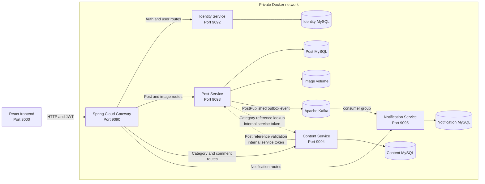
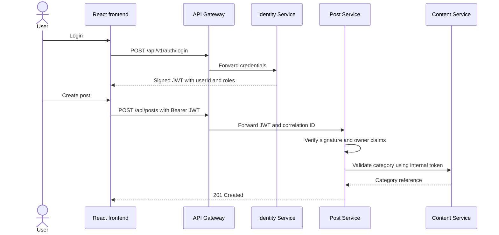

# Architecture Reference

## System Context

The React client knows one public backend address. Spring Cloud Gateway preserves stable URLs while routing each capability to the service that owns it.

Only the gateway publishes a backend host port. Business services and their databases remain private in Docker Compose.

## Route Ownership

| Public route group | Owner | Responsibility |
| --- | --- | --- |
| `/api/v1/auth/**`, `/api/users/**` | Identity Service | Registration, login, profiles, roles, JWT issuance |
| `/api/posts`, `/api/post/**`, search/user/category post routes | Post Service | Posts, category snapshots, post images, ownership rules |
| `/api/categories/**`, `/api/posts/{id}/comments`, `/api/comments/**` | Content Service | Categories, comments, comment ownership rules |
| `/api/notifications/**` | Notification Service | Authenticated user's asynchronous notifications |
| `/actuator/health`, `/actuator/info` | API Gateway | Public operational status |

There is no public catch-all route. Unknown APIs and `/internal/**` are not forwarded.

## Data Ownership

| Service | Owned data | Deliberately not shared |
| --- | --- | --- |
| Identity | Users, BCrypt hashes, roles, user-role mappings | Post and comment rows |
| Post | Posts, category snapshots, image names/files | Identity and Content tables |
| Content | Categories and comments | Identity and Post tables |
| Notification | User notifications and processed event IDs | Identity, Post, and Content tables |

Cross-boundary relationships use scalar identifiers such as `authorId`, `postId`, and `categoryId`. A post stores a category snapshot so reads do not create an N+1 HTTP call pattern.

## Authentication and Authorization

- Identity signs JWTs containing issuer, subject, immutable `userId`, and roles.
- Post and Content verify the token locally; they do not call Identity for every request.
- Owner-or-admin rules are enforced in the service that owns the resource.
- Private reference endpoints use a separate internal credential and are unavailable through the gateway.
- The HMAC secret is shared during this migration stage. Asymmetric signing and JWKS are a future production hardening step.

## Reliability Behavior

- Gateway connection and response timeouts prevent unbounded waits.
- Gateway failures use consistent JSON `503` or `504` responses.
- Correlation IDs are validated or generated at the gateway and returned to clients.
- Post creation fails safely when category validation is unavailable.
- Comment creation fails safely when Post reference validation is unavailable.
- Every service and database has an independent health check.
- Flyway owns schema creation; production uses Hibernate validation rather than automatic mutation.
- Post creation atomically records an outbox event, so Kafka downtime does not lose publication intent.
- Notification consumption is idempotent, and retry exhaustion routes malformed or repeatedly failing events to a DLT.

## Migration Strategy

The migration used the strangler pattern:

1. Harden the modular monolith and remove cross-domain object graphs.
2. Put a stable gateway in front of unchanged client URLs.
3. Extract Identity and give it an independent database.
4. Extract Posts and images, replacing shared relationships with explicit contracts.
5. Extract Categories and Comments, remove the gateway catch-all, and retire the monolith from the active runtime.
6. Introduce Kafka behind a transactional outbox and add Notification Service as an asynchronous consumer.

Legacy source remains temporarily as a rollback asset, but it is not part of the active Docker topology.
