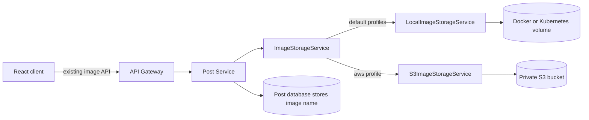

# AWS S3 Image Storage

## Purpose And Scope

This phase makes the Post Service capable of storing post images in Amazon S3 without changing the frontend contract or deploying anything to AWS. The existing local filesystem remains the default for Docker Compose, Minikube, tests, and the current live application.

No bucket, IAM user, access key, cloud resource, or live environment is created by this repository change. The AWS implementation is activated only when an operator deliberately enables the `aws` Spring profile and supplies a bucket name.

## Architecture



The database stores only the generated image name, such as `8d4...c1.png`. The provider converts that name into either a safe local path or an S3 object key such as `post-images/8d4...c1.png`. This keeps persistence and API contracts independent of AWS.

The public endpoints remain unchanged:

```text
POST /api/post/image/upload/{postId}
GET  /api/post/image/{imageName}
```

The React application therefore requires no S3-specific code, SDK, bucket URL, or credentials.

## Provider Selection

Local storage is the safe default:

```properties
app.image.storage.provider=local
app.image.storage.local-path=${POST_IMAGE_PATH:images/}
app.image.storage.max-size-bytes=${POST_IMAGE_MAX_SIZE_BYTES:10485760}
```

For a future AWS environment, start the Post Service with both its deployment profile and the AWS storage profile:

```text
SPRING_PROFILES_ACTIVE=prod,aws
POST_IMAGE_S3_BUCKET=replace-with-the-provisioned-private-bucket
AWS_REGION=eu-west-1
POST_IMAGE_S3_KEY_PREFIX=post-images
```

The `aws` profile supplies:

```properties
app.image.storage.provider=s3
app.image.storage.s3.bucket=${POST_IMAGE_S3_BUCKET}
app.image.storage.s3.region=${AWS_REGION:eu-west-1}
app.image.storage.s3.key-prefix=${POST_IMAGE_S3_KEY_PREFIX:post-images}
```

Optional settings are available for an S3-compatible local emulator and bounded SDK calls:

| Environment variable | Default | Purpose |
| --- | --- | --- |
| `POST_IMAGE_S3_ENDPOINT` | empty | Optional endpoint override; leave empty for AWS |
| `POST_IMAGE_S3_PATH_STYLE_ACCESS` | `false` | Enable only when an emulator requires path-style requests |
| `POST_IMAGE_S3_API_CALL_TIMEOUT` | `10s` | Maximum duration of an entire SDK operation |
| `POST_IMAGE_S3_API_CALL_ATTEMPT_TIMEOUT` | `5s` | Maximum duration of one SDK attempt |
| `POST_IMAGE_MAX_SIZE_BYTES` | `10485760` | Application-level upload limit in bytes |

Spring's multipart limits remain set to 10 MB as the outer HTTP boundary.

## Credential Strategy

The service uses the AWS SDK default credential provider chain. It does not read an access key or secret key from application properties and no credentials belong in Git.

Recommended production identity:

- EKS: associate a least-privilege IAM role with the Post Service workload using EKS Pod Identity or IRSA
- ECS: use an ECS task role
- EC2: use an instance profile
- developer workstation: use an approved AWS profile or short-lived SSO session

The workload role needs only the image prefix in the selected bucket. A future infrastructure policy can grant:

```json
{
  "Version": "2012-10-17",
  "Statement": [
    {
      "Effect": "Allow",
      "Action": [
        "s3:GetObject",
        "s3:PutObject",
        "s3:DeleteObject"
      ],
      "Resource": "arn:aws:s3:::REPLACE_BUCKET/post-images/*"
    }
  ]
}
```

This is an example to explain least privilege; it is not applied automatically.

## Security And Reliability Decisions

- The bucket is expected to be private with S3 Block Public Access enabled.
- Images are streamed through the application-owned image endpoint; public object URLs are not returned. Image reads keep their existing public behavior, while uploads remain authenticated and ownership-protected.
- Upload names are generated UUIDs, preventing user-controlled object keys and accidental overwrites.
- File type is validated using MIME type, extension, and JPEG/PNG/WebP magic bytes.
- Stored names reject directory separators and traversal sequences.
- S3 writes request server-side encryption with Amazon S3 managed keys (`AES256`).
- SDK operation and attempt timeouts prevent an unavailable storage dependency from hanging a request indefinitely.
- Missing objects become the same application-level `404` response as missing local files.
- Other storage failures become `503 Service Unavailable`, distinguishing infrastructure failure from invalid input.
- If the database update fails after an upload, the newly stored object is deleted as compensation.

For a stricter regulated workload, a later phase can replace SSE-S3 with a customer-managed KMS key, add malware scanning, image re-encoding, presigned upload URLs, CloudFront delivery, and lifecycle/retention policies.

## Rollout Plan

1. Provision the private bucket and workload role using infrastructure as code.
2. Keep the current local provider active while deploying the S3-capable artifact.
3. Copy existing image files into the configured S3 prefix while preserving their filenames.
4. Verify object count, checksums, content types, encryption, and workload-role access.
5. Enable `SPRING_PROFILES_ACTIVE=prod,aws` and the bucket variables for one environment.
6. Smoke-test existing image reads, new upload, replacement, authentication, and error responses.
7. Monitor S3 errors, request latency, and Post Service `5xx` responses before expanding rollout.

Because object names do not change, no database migration is required when existing files are copied with the same names.

## Rollback Plan

Disable the `aws` profile and return `IMAGE_STORAGE_PROVIDER` to `local`. The earlier local files must still be present, or the S3 objects must first be copied back into `POST_IMAGE_PATH`. Database rows do not change because they contain provider-neutral filenames.

## Verification

Automated tests cover:

- local store, load, delete, traversal rejection, and missing files
- MIME type, extension, size, and file-signature validation
- S3 bucket and prefix selection
- content type and content length metadata
- SSE-S3 encryption and absence of a public ACL
- S3 download and deletion
- S3 missing-object mapping to the application `404`

Run the focused suite with:

```bash
mvn -f post-service/pom.xml clean test
```

The S3 tests mock the AWS SDK client and do not require an AWS account. A live integration test belongs in the future infrastructure phase after a disposable AWS test environment or an approved emulator is available.

## Interview Explanation

An accurate summary is:

> I introduced a hexagonal storage boundary in the Post Service. Local volume storage remains the default, while an AWS profile selects a private S3 adapter. The API and database store provider-neutral image names, the AWS SDK uses workload credentials, uploads are validated and encrypted, and storage failures are mapped consistently. I designed the AWS rollout and rollback but deliberately did not create cloud resources in this phase.

This demonstrates production-oriented AWS integration without claiming that the portfolio environment is already running on AWS.
