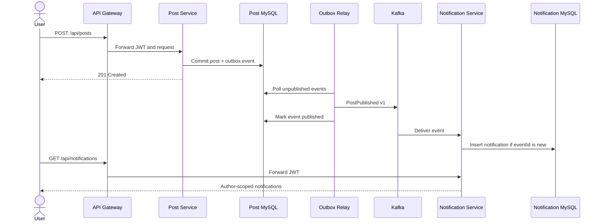

# Phase 6: Kafka Event-Driven Notifications

## Objective

Phase 6 adds a real asynchronous business workflow without weakening Post Service database consistency. Creating a post produces a durable publication notification through Apache Kafka.



## Why an Outbox

A direct sequence of `save post -> publish Kafka message` can lose the event if the database commits and Kafka is unavailable. Reversing the order can publish an event for a post that later rolls back.

Post Service therefore writes `service_posts` and `post_outbox_events` in the same local database transaction. The relay publishes pending rows later, so broker downtime delays notifications without losing the committed intent.

## Event Contract

Topic: `blog.posts.published.v1`

Kafka key: `postId`

Payload fields:

| Field | Purpose |
| --- | --- |
| `eventId` | Stable idempotency identifier |
| `eventVersion` | Explicit schema version; currently `1` |
| `postId` | Published post identifier |
| `authorId` | Notification recipient |
| `title` | Human-readable notification detail |
| `categoryId`, `categoryTitle` | Event-time category context |
| `occurredAt` | UTC event timestamp |

The version is part of the payload so incompatible consumers can reject an unsupported contract rather than silently misinterpreting it.

## Delivery Semantics

The workflow provides at-least-once delivery:

- The producer uses `acks=all` and Kafka idempotent-producer settings.
- The outbox relay retries failed publication with bounded exponential backoff.
- A crash after Kafka accepts a record but before the outbox row is marked can cause redelivery.
- Notification Service stores `eventId` under a unique constraint and ignores an event already processed.
- Consumer processing failures receive two retries with a one-second backoff.
- Exhausted or invalid records are published to `blog.posts.published.v1.DLT`.

This is intentionally not described as exactly-once processing: the design achieves the required business effect through at-least-once delivery plus idempotency.

## Data Ownership

- Post Service owns posts and the producer outbox.
- Kafka owns the durable transport log.
- Notification Service owns notification rows and consumer idempotency.
- Notification Service does not query the Post database.
- The gateway forwards JWTs, and Notification Service returns only the authenticated user's records.

## Local Verification

Start the stack:

```powershell
docker compose up -d --build
```

Inspect topics:

```powershell
docker exec blog-kafka /opt/kafka/bin/kafka-topics.sh --bootstrap-server localhost:29092 --describe --topic blog.posts.published.v1
docker exec blog-kafka /opt/kafka/bin/kafka-topics.sh --bootstrap-server localhost:29092 --describe --topic blog.posts.published.v1.DLT
```

After registering, logging in, and creating a post, call:

```text
GET /api/notifications
Authorization: Bearer <identity-token>
```

The Docker and Kubernetes smoke tests poll this endpoint for the notification associated with the newly created post.

## Failure Demonstration

Stop Kafka, create a post, and inspect the Post Service outbox. The post remains committed while its event remains unpublished. Start Kafka again; the relay publishes the pending row and Notification Service consumes it.

To demonstrate consumer recovery, introduce a deliberately invalid record in a disposable local environment and verify that it reaches the DLT after the configured retry policy.

## Scaling Notes

- The topic has three partitions and the post ID key preserves ordering per post.
- Multiple Notification Service instances can share the consumer group.
- Multiple Post Service relay instances may race and publish duplicates; consumer idempotency preserves the result. A production fleet can add row claiming or database locks to reduce duplicate sends.
- The local single-node Kafka broker and replication factor `1` are for development and portfolio demonstration. Production requires a replicated managed or multi-broker cluster with authentication, encryption, ACLs, monitoring, and an operational DLT replay process.

## Interview Summary

“I added Kafka through a real publication-notification workflow. Post Service uses a transactional outbox to avoid the database/message dual-write problem. A relay publishes a versioned `PostPublished` event with `acks=all`; Notification Service consumes it using a stable consumer group and persists an author-scoped notification. Since the workflow is at-least-once, the event ID is uniquely stored to make consumption idempotent. Retry exhaustion routes records to a dead-letter topic, and Docker, Kubernetes, Jenkins, and smoke tests include the entire path.”
